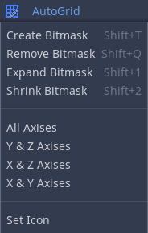

# AutoGrid
###### Version 1.0
AutoGrid is an autotile system for the GridMap node in the Godot Engine. AutoGrid works similar to the TileMap node.

## **Installation**
1. Copy the "addons/AutoGrid" folder to your "addons" folder in the project directory. If you don't have any "addons" folder you can create it. 
2. Set the AutoGrid as active in "Project>Project Settings>Plugins". 

## **Usage**
All AutoGrid settings are in the AutoGrid dock panel which is in same tab as the inspector panel. 

### **Setting the bitmasks**
1. Set the scene as shown in [Creating a MeshLibrary](https://docs.godotengine.org/en/stable/tutorials/3d/using_gridmaps.html). 
2. Enable the "Edit Mode" from the AutoGrid panel then select a MeshInstance you want to create the bitmask of it. 

3. You will see a button named "AutoGrid" on top of the scene panel.
   - Create Bitmask: Creates a bitmask for the selected MeshInstance.
   - Remove Bitmask: Deletes the bitmask of the selected MeshInstance.
   - Increase Bitmask: Increases visual size of the bitmasks.
   - Decrease Bitmask: Decreases visual size of the bitmasks.
   - 3D: Shows the full bitmask.
   - Only X: Shows the only x axis of the bitmask (Global X).
   - Only Y: Shows the only y axis of the bitmask (Global Y).
   - Only Z: Shows the only z axis of the bitmask (Global Z).
   - Set Icon: Sets the icon for the AutoGrid tile to be created (Default is the first child of the scene, selected icon will be shown as blue transparent sphere).
4. After creating the bitmask you can simply paint it by clicking on white cubes, painted cubes will become red. Click on the cube again for disabling it. 

### **Creating autotile info**
After setting all the bitmasks. Click to "Create Autotile Info" button located in the AutoGrid panel. Then create MeshLibrary again and you are ready to go! The autotile system will work now. 

***Read "addons>AutoGrid>HELP.pdf" for more information***

### **Settings**

- Autotile: Enables autotile system.
- Autotile Mode:
  - Full 3x3: Checks every corner for fit the perfect tile for that place (Same as tilemap).
  - Minimal 3x3: Checks the corners three by three (Same as tilemap).
- Autotile Axis: Limits the autotile check axis.
- Edit Mode: Enables the bitmap edit button.
- Performance Mode: If enabled only checks for new tiles, do not check for repainted tiles (If map is too big, enabling this might increase the performance).
- Reload Autotile Info: Reloads the bitmasks value.
- Create Autotile Info: Creates the autotile file.

## **Limitations**
- AutoGrid doesn't provide extended MeshLibrary, therefore all limitations on the MeshLibrary will remain.
- You need to move your cursor to the scene while using edit mode shortcuts.
- Re-open the Godot Engine will set all the bitmasks as active (If no need to edit the bitmasks then you can ignore this). However, reloading the autotile info (if any available) will solve this.
- since the GridMap node doesn't have a last edited cell variable, performance cost will increase with the cell count.
